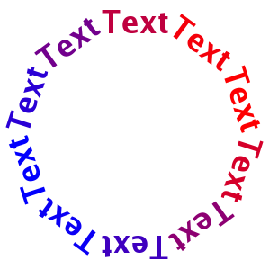

# Font handling and rendering with Cairo

The Cairo library is a vector graphics library with a powerful rendering
model. It has such features as anti-aliased primitives, alpha-compositing,
and gradients. Multiple backends for Cairo are available, to allow
rendering to images, to PDF files, and to the screen on X and on other
windowing systems. The functions in this section allow using Pango
to render to Cairo surfaces.

Using Pango with Cairo is straightforward. A #PangoContext created
with pango_cairo_font_map_create_context() can be used on any
Cairo context (cairo_t), but needs to be updated to match the
current transformation matrix and target surface of the Cairo context
using pango_cairo_update_context(). The convenience functions
pango_cairo_create_layout() and pango_cairo_update_layout() handle
the common case where the program doesn't need to manipulate the
properties of the #PangoContext.

When you get the metrics of a layout or of a piece of a layout using
functions such as pango_layout_get_extents(), the reported metrics
are in user-space coordinates. If a piece of text is 10 units long,
and you call cairo_scale (cr, 2.0), it still is more-or-less 10
units long. However, the results will be affected by hinting
(that is, the process of adjusting the text to look good on the
pixel grid), so you shouldn't assume they are completely independent
of the current transformation matrix. Note that the basic metrics
functions in Pango report results in integer Pango units. To get
to the floating point units used in Cairo divide by %PANGO_SCALE.

## Using Pango with Cairo ## {#rotated-example}

```
#include <math.h>
#include <pango/pangocairo.h>

#define RADIUS 150
#define N_WORDS 10
#define FONT "Sans Bold 27"

static void
draw_text (cairo_t *cr)
{
  PangoLayout *layout;
  PangoFontDescription *desc;
  int i;

  /* Center coordinates on the middle of the region we are drawing */
  cairo_translate (cr, RADIUS, RADIUS);

  /* Create a PangoLayout, set the font and text */
  layout = pango_cairo_create_layout (cr);

  pango_layout_set_text (layout, "Text", -1);
  desc = pango_font_description_from_string (FONT);
  pango_layout_set_font_description (layout, desc);
  pango_font_description_free (desc);

  /* Draw the layout N_WORDS times in a circle */
  for (i = 0; i < N_WORDS; i++)
    {
      int width, height;
      double angle = (360. * i) / N_WORDS;
      double red;

      cairo_save (cr);

      /* Gradient from red at angle == 60 to blue at angle == 240 */
      red   = (1 + cos ((angle - 60) * G_PI / 180.)) / 2;
      cairo_set_source_rgb (cr, red, 0, 1.0 - red);

      cairo_rotate (cr, angle * G_PI / 180.);

      /* Inform Pango to re-layout the text with the new transformation */
      pango_cairo_update_layout (cr, layout);

      pango_layout_get_size (layout, &amp;width, &amp;height);
      cairo_move_to (cr, - ((double)width / PANGO_SCALE) / 2, - RADIUS);
      pango_cairo_show_layout (cr, layout);

      cairo_restore (cr);
    }

  /* free the layout object */
  g_object_unref (layout);
}

int
main (int argc, char **argv)
{
  cairo_t *cr;
  char *filename;
  cairo_status_t status;
  cairo_surface_t *surface;

  if (argc != 2)
    {
      g_printerr ("Usage: cairosimple OUTPUT_FILENAME\n");
      return 1;
    }

  filename = argv[1];

  surface = cairo_image_surface_create (CAIRO_FORMAT_ARGB32,
                                        2 * RADIUS, 2 * RADIUS);
  cr = cairo_create (surface);

  cairo_set_source_rgb (cr, 1.0, 1.0, 1.0);
  cairo_paint (cr);
  draw_text (cr);
  cairo_destroy (cr);

  status = cairo_surface_write_to_png (surface, filename);
  cairo_surface_destroy (surface);

  if (status != CAIRO_STATUS_SUCCESS)
    {
      g_printerr ("Could not save png to '%s'\n", filename);
      return 1;
    }

  return 0;
}
```

Once you build and run the example code above, you should see the
following result:


