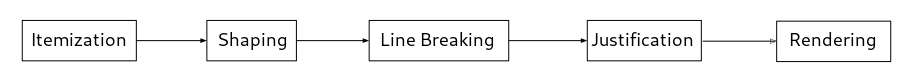

# Pango Rendering

The Pango rendering pipeline takes a string of Unicode characters and converts
it into glyphs. This section describes the functions that implement the various
stages of this pipeline.

* Itemization breaks a piece of text into segments with consistent direction
  and shaping properies. Among other things, this determines which font to use
  for each character. Use pango_itemize() or pango_itemize_with_base_dir()
  to itemize text.

* Shaping converts characters into glyphs. Use pango_shape(), pango_shape_full()
  or pango_shape_with_flags() to shape text.

* Line Breaking determines where line breaks should be inserted into a sequence
  of glyphs. The function pango_break() determines possible line breaks. The
  actual line breaking is done by PangoLayout.

* Justification adjusts inter-word spacing to form lines of even length. This
  is done by PangoLayout.

* Rendering takes a string of positioned glyphs, and renders them onto a
  surface. This is accomplished by a PangoRenderer object. The functions
  pango_cairo_show_glyph_string() and pango_cairo_show_layout() use a
  PangoRenderer to draw text onto a cairo surface.
